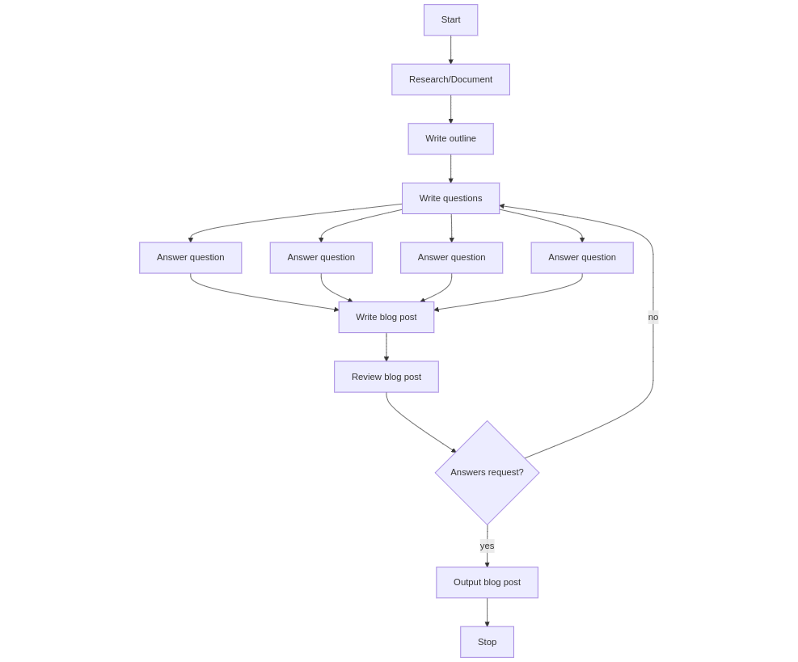

# Blog Post Generator

An intelligent document analysis and blog post generation tool powered by LlamaIndex and OpenAI. This application allows users to upload PDF documents and generate insightful blog posts or answers based on the content using advanced RAG (Retrieval-Augmented Generation) techniques.

## 🌟 Features

- **Document Upload**: Support for PDF file uploads
- **Intelligent Analysis**: Uses LlamaIndex for efficient document processing and information retrieval
- **Interactive UI**: Built with Streamlit for a seamless user experience
- **Real-time Progress**: Live progress updates during document processing
- **Persistent Storage**: Vector storage using Qdrant for efficient document retrieval
- **Customizable Queries**: Flexible query system to generate specific content from your documents

## Methods

The following flowchart illustrates the blog post generation process (inspired by Llama Index blog post):



## 🔧 Tech Stack

- Python 3.11+
- Streamlit
- LlamaIndex
- OpenAI
- Qdrant
- Poetry for dependency management

## 📋 Prerequisites

- Python 3.11 or higher
- Poetry package manager
- OpenAI API key
- LlamaIndex API key
- Qdrant API key and URL
- Docker (optional, for containerized deployment)

## 🚀 Getting Started

1. Clone the repository:
   ```bash
   git clone https://github.com/Xphi310302/blog-post-generation.git
   cd blog-post-generation
   ```

2. Install dependencies using Poetry:
   ```bash
   poetry install
   ```

3. Set up your environment variables:
   Create a `.env` file with:
   ```
   OPENAI_API_KEY="key"
   LLAMA_CLOUD_API_KEY="key"
   QDRANT_URL="url"
   QDRANT_API_KEY="key"
   ```

4. Run the application:
   ```bash
   poetry run streamlit run main.py
   ```

## 🎯 Usage

1. Launch the application
2. Upload one or more PDF documents using the file uploader
3. Enter your query or topic for blog post generation
4. Click "Run" to generate content
5. View the generated content with real-time progress updates

## 🐳 Docker Support

Build and run using Docker:

```bash
docker build -t blog-post-generator .
docker run -p 8501:8501 blog-post-generator
```

## 🔑 Key Components

- `main.py`: Core application logic and Streamlit UI
- `agent/`: Contains the DocumentResearchAgent implementation
- `data/`: Temporary storage for uploaded files

## 📝 License

MIT

## 📝 TODO
- [ ] Add support for link/url crawling
- [ ] Add option to save generated blog posts
- [ ] Create unit tests for core functionality
- [ ] Implement caching mechanism for frequently accessed data
